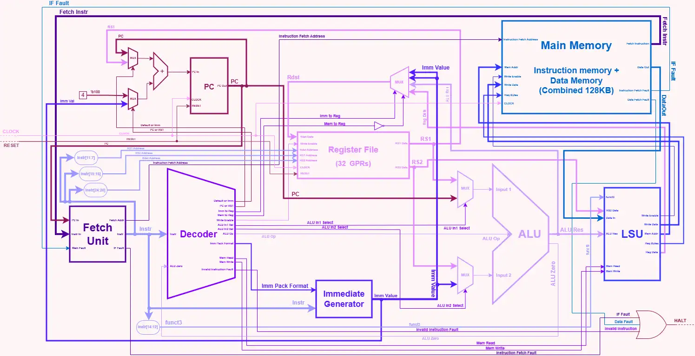

# riscVia
A minimalist & modular RISC-V processor based on the RV32I architecture.

## Specifications
The CPU is based on the RV32I architecture. It contains implementation the base 40 instructions (minus `FENCE`, which is a NOP). Specifications include 32 General Purpose Registers (x0 hardwired to 0), 32-bit word size, 32-bit instruction size, and a 32-bit program counter (PC). For more information related to the RV32I architecture, please check the [official RISC-V specification.](https://docs.riscv.org/reference/isa/v20260120/unpriv/rv32.html)

## Diagram

